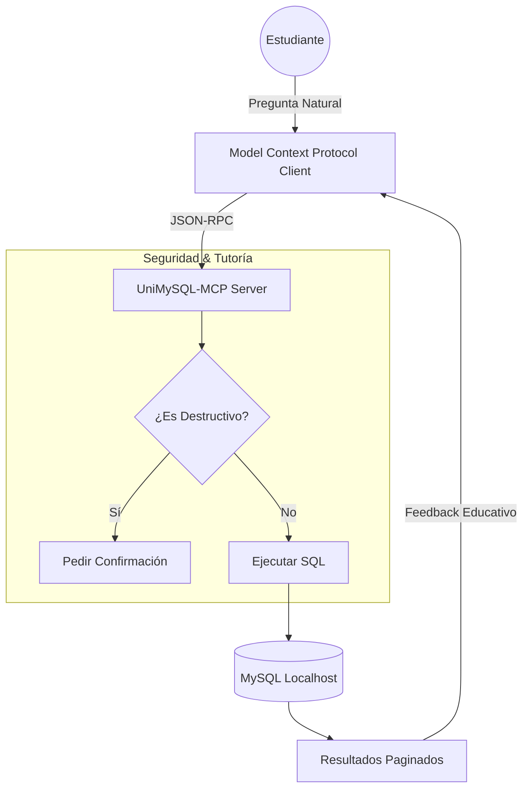

# 🎓 UniMySQL-MCP (Tutor Edition)

[](https://opensource.org/licenses/MIT)
[](https://www.python.org/downloads/)
[](https://modelcontextprotocol.io)

> **UniMySQL-MCP** no es solo un conector de base de datos; es el tutor que desearías haber tenido en primer año de facultad. Transforma tu IA en un experto en SQL que te guía, te protege y te enseña.

---

## 🌟 ¿Qué hace a UniMySQL único?

A diferencia de otros servidores MCP que son "cajas negras" o riesgos de seguridad, UniMySQL está construido bajo la filosofía de **Aprendizaje Supervisado**:

### 1. 🛡️ Capa de Supervisión Interactiva
Si intentas realizar un `DELETE` o `UPDATE`, el servidor intercepta la petición. El Tutor explica las consecuencias y solo ejecuta el comando si confirmas explícitamente. ¡Adiós a los errores catastróficos!

### 2. 📊 Planificador Educativo (Explain-First)
Incorporamos herramientas de auditoría que analizan cómo MySQL ejecuta tus consultas. La IA puede detectar si te falta un índice o si tu consulta es ineficiente antes de que se convierta en un problema.

### 3. 🔗 Mapeo de Relaciones (Oracle Style)
Detectamos automáticamente las Claves Foráneas (FK) y las presentamos de forma clara para que el LLM entienda tu esquema sin alucinaciones.

### 4. 📁 Exportación Masiva (CSV/JSON)
¿Necesitas sacar miles de filas? Nuestra herramienta de exportación guarda los datos directamente en una carpeta local (`exports/`), evitando saturar el chat y ahorrando tokens.

---

## 🏗️ Cómo funciona (Arquitectura)



---

## 🚀 Instalación Ultra-Rápida

### Opción Global (Recomendada)
Hemos creado un script que configura todo por ti. Solo descarga y corre:

```bash
curl -sSL https://raw.githubusercontent.com/adiego-101/unimysql-mcp/main/setup.sh | bash
```

### Manual (Paso a paso)
1. **Clona el repo:**
   ```bash
   git clone https://github.com/adiego-101/unimysql-mcp.git
   cd unimysql-mcp
   ```
2. **Instala dependencias:**
   ```bash
   pip install mcp mysql-connector-python python-dotenv
   ```
3. **Configura tu `.env`:**
   Copia `.env.example` a `.env` y ajusta tus credenciales.

---

## 🛠️ Configuración en Agentes

### Claude Desktop
Añade esto a tu `claude_desktop_config.json`:
```json
"unimysql": {
  "command": "python",
  "args": ["/ruta/absoluta/a/unimysql_mcp/server.py"]
}
```

### Cursor / Gemini CLI
Solo apunta el servidor MCP a la ruta del archivo `server.py`.

---

## 🔐 El "Usuario Tutor" (Buenas Prácticas)
No uses `root`. Sigue nuestra guía para crear un usuario con los permisos exactos:

```sql
CREATE USER 'mcp_tutor'@'localhost' IDENTIFIED BY 'tu_password';
GRANT SELECT, INSERT, UPDATE, DELETE ON universidad.* TO 'mcp_tutor'@'localhost';
FLUSH PRIVILEGES;
```

---

## 🤝 Contribuir
Este es un proyecto **Open Source** para estudiantes. Si tienes una idea para una nueva herramienta educativa, ¡abre un PR! 

*Hecho con ❤️ para la comunidad de OpenAI y estudiantes de todo el mundo.* ⭐
